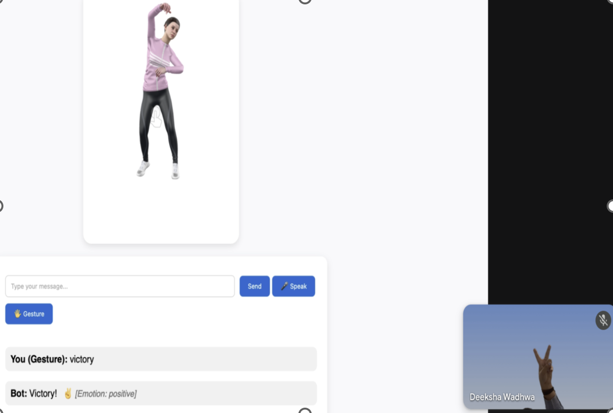
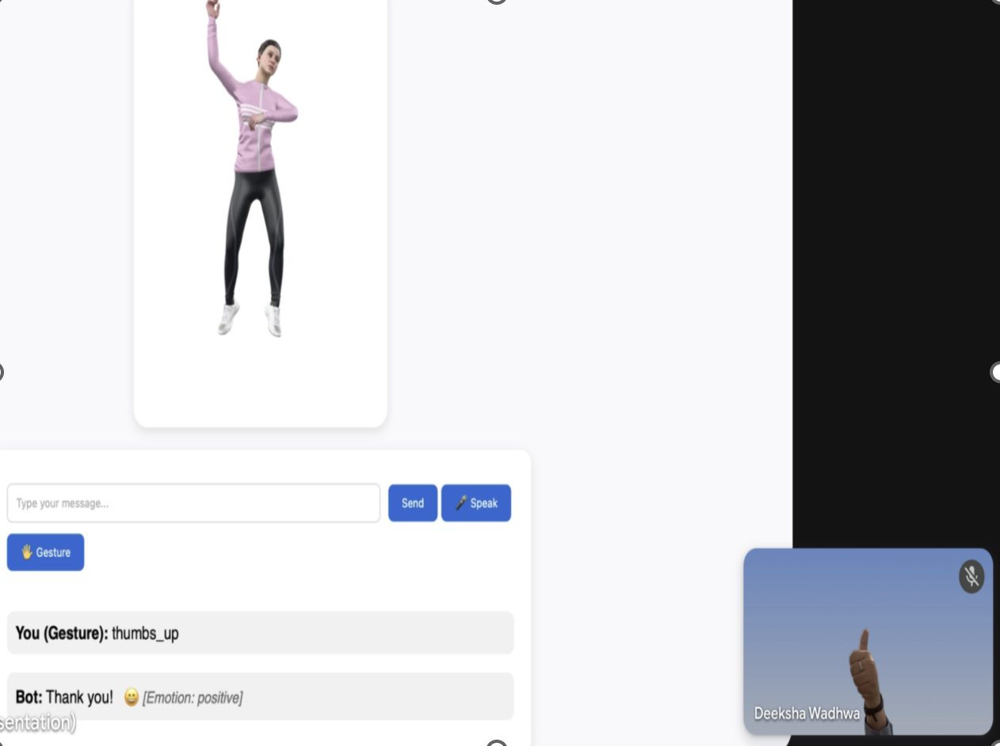

# Virtual Humanoid Female Robot – Demo

🎯 **Project Overview:**  
This AI-powered humanoid robot accepts **text, voice, or gestures** as input and generates **three simultaneous outputs**:  
1. Text displayed on screen  
2. Speech in female voice (using gTTS)  
3. 3D animation updated based on detected emotion (happy, sad, neutral)  

The project demonstrates **multimodal AI, NLP, sentiment analysis, computer vision, full-stack integration, and 3D animation handling**.

---

## **Demo Video:**  
🎥 Watch the robot in action: [YouTube Demo Video]https://youtu.be/LbdrTE5INro  
🎥 [Watch the Robot in Action](https://youtu.be/LbdrTE5INro)  


---

## **Technologies Used:**  
- **Backend:** Python, Rasa, Flask  
- **Frontend:** HTML, CSS  
- **Computer Vision:** OpenCV, MediaPipe  
- **Natural Language Processing & Sentiment Analysis:** VADER  
- **Text-to-Speech:** gTTS  
- **3D Animation:** `.glb` files, ModelViewer  

---
## **System Architecture (Conceptual):**  


## **Features Highlight:**  
- Multimodal input: **text, voice, gestures**  
- Gesture recognition:
  - Thumbs Up  
  - Victory  
  - Open Palm  
  - Fist  
  - No Gesture Detected  
  *(Webcam activates when “gesture” button is clicked)*  
- Synchronous output: **text + voice + animation**  
- Emotion-based animation update: **happy, sad, neutral**  
- Full conversation displayed as **text on screen**  

---
## 🏆 Achievement of Aim and Objectives  

The project successfully met its aim of creating a virtual humanoid agent capable of emotionally intelligent interaction through multimodal inputs and dynamic visual feedback.  

### Key Achievements  
- 📚 Conducted literature review to build a strong theoretical foundation.  
- 🤖 Developed a conversational agent with **RASA** for intent recognition and dialogue flow.  
- 🎭 Integrated **VADER sentiment analysis** for emotion-aware responses.  
- ✋ Implemented **gesture recognition** with MediaPipe + OpenCV for hands-free interaction.  
- 🎤 Enabled natural communication using **speech-to-text** and **text-to-speech**.  
- 🧑‍🎨 Visualized emotional states with expressive **3D humanoid GLB models**.  
- 💻 Built a **responsive front-end** for seamless control and interaction.  
- ✅ Validated the system through testing and user interaction, showing effective emotional responsiveness and engagement.  

## **Screenshots / GIFs:**  
 
### Emotion-based Animations
<br>

<br>

<br>


### Gesture Recognition (Screenshots)
 



Remaining gestures (Open Palm, Fist, No Gesture Detected) and full robot interactions are demonstrated in the YouTube demo video: Watch Demo

---

## **How to Run the Demo (Important Notes):**  

> ⚡ This repository contains only **demo snippets and documentation**.  
> The **full codebase (including Rasa setup)** is private to avoid misuse and complexity.  

### 🔧 Development Setup (for reference):  

1. **Run Rasa server:**  
   ```bash
   rasa run
   rasa run actions
2. **Run Flask frontend:**
   ```bash
   python app.py

Flask will start a local server at:
👉 http://localhost:5000/ (open this in your browser to view the interface).

Interact with the robot:

- Type text input
- Speak into the microphone for voice input
- Enable webcam and use gestures (thumbs up, victory, palm, fist)

⚡ Note for recruiters / reviewers:

The localhost server runs only on the developer’s machine.

To see the fully working system, please refer to the YouTube demo video: Watch Demo

The full private repo can be shared on request.


